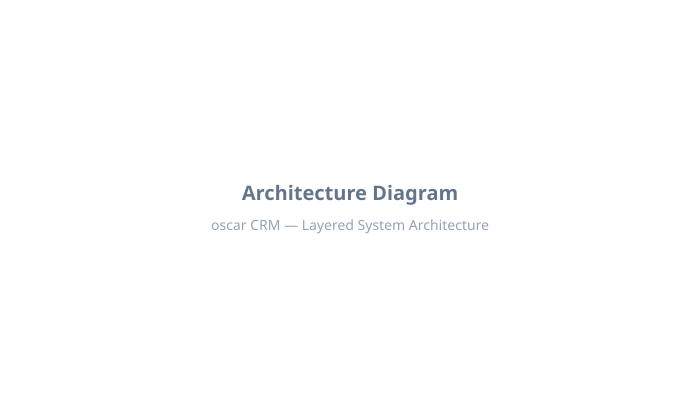

<div align="center">
  <picture>
    <source srcset=".github/assets/oscar-banner-dark.svg" media="(prefers-color-scheme: dark)">
    
  </picture>
  <br />
  <br />
  <p><em>A production-grade, open-source CRM backend built in Go with multi-tenant SaaS architecture, designed for scalability and performance.</em></p>
</div>

## Features

<div align="center">
  
  <br />
  <em>Dashboard preview (screenshot placeholder)</em>
</div>

### Core CRM
- **Multi-tenant Architecture**: Complete tenant isolation with Row Level Security (RLS)
- **Contacts Management**: Persons (leads, contacts, customers) with tags, scores, and custom fields
- **Company Management**: Track companies with industry, size, revenue, and associations
- **Deal Pipeline**: Kanban boards, multiple pipelines, stages, and probability tracking
- **Activity Tracking**: Notes, calls, emails, meetings, tasks with timeline view
- **Product Catalog**: Manage products and services with pricing
- **Teams & Roles**: Organize users into teams with role-based permissions

### Security & Auth
- **Paseto v2 Authentication**: Stateless, secure token-based authentication
- **Role-Based Access Control**: Flexible permission system (Owner, Admin, Manager, Sales Rep, Read Only)
- **Row Level Security**: Database-level tenant isolation for maximum security
- **OAuth Support**: Google and Apple OAuth integrations
- **Email Verification**: Account verification with secure tokens
- **Invitation System**: Team invitations with secure token-based flow
- **API Keys**: Programmatic access via API keys

### Customization
- **Custom Fields** (API ready): Domain and repository exist; handlers and UI pending
- **White-label Branding**: Custom logos, colors, fonts per tenant
- **Automation Engine** (API ready): Domain and repository exist; handlers and UI pending
- **Webhook Support**: Defined in automation actions (execution pending)

### Developer Experience
- **sqlc Integration**: Type-safe SQL queries with code generation
- **Repository Pattern**: Clean separation between data access and business logic
- **Comprehensive Error Handling**: Structured error responses with HTTPError interface
- **Cursor-based Pagination**: Efficient pagination for large datasets
- **Soft Deletes**: All major entities support soft deletion with recovery

## Tech Stack

| Component | Technology | Purpose |
|-----------|------------|---------|
| Language | Go 1.24+ | Backend API |
| Framework | Echo v4 | HTTP routing |
| Database | PostgreSQL 16 | Primary data store |
| ORM/Driver | pgx/v5 | Database access |
| Code Gen | sqlc | Type-safe SQL |
| Auth | Paseto v2 | Token authentication |
| Validation | go-playground/validator | Request validation |
| File Storage | AWS S3 SDK | Avatar/branding uploads |
| Image Processing | disintegration/imaging | Image manipulation |
| Cache | Redis (planned) | Caching (in go.mod, not wired) |
| Testing | testify | Unit testing |

## Project Structure

```
oscar/
├── cmd/
│   └── server/              # Application entry point
│       └── main.go           # Server initialization and wiring
│
├── internal/
│   ├── api/                 # HTTP layer
│   │   ├── handlers/        # Request handlers
│   │   │   ├── auth.go      # Authentication endpoints
│   │   │   ├── persons.go   # Person CRUD operations
│   │   │   ├── companies.go # Company CRUD operations
│   │   │   ├── deals.go     # Deal and pipeline operations
│   │   │   ├── pipelines.go # Pipeline management
│   │   │   ├── activities.go# Activity tracking
│   │   │   ├── products.go  # Product catalog
│   │   │   ├── users.go     # User management
│   │   │   ├── teams.go     # Team management
│   │   │   ├── notifications.go
│   │   │   ├── invitations.go
│   │   │   ├── settings.go  # Tenant settings
│   │   │   ├── upload.go    # File uploads
│   │   │   ├── custom_fields.go # Custom fields (pending)
│   │   │   └── audit_log.go # Audit log
│   │   ├── middleware/      # HTTP middleware
│   │   │   └── middleware.go# Auth, tenant resolution, rate limiting
│   │   ├── routes.go        # Route definitions
│   │   ├── server.go        # Echo server setup
│   │   └── ws/              # WebSocket support (planned)
│   │       └── handler.go   # Real-time communication (planned)
│   │
│   ├── config/              # Configuration management
│   │   └── config.go        # Env var loading
│   │
│   ├── db/                  # Database layer
│   │   ├── generated/       # sqlc generated code
│   │   │   ├── models.go    # Generated model types
│   │   │   └── *.sql.go    # Generated query functions
│   │   ├── repositories/    # Data access layer
│   │   │   ├── person.go    # Person repository
│   │   │   ├── company.go   # Company repository
│   │   │   ├── deal.go      # Deal & pipeline repository
│   │   │   ├── deal_line_item.go
│   │   │   ├── activity.go  # Activity & association repository
│   │   │   ├── team.go      # Team management
│   │   │   ├── tenant.go    # Tenant & branding
│   │   │   ├── user.go      # User & role management
│   │   │   ├── custom_field.go
│   │   │   ├── automation.go # Automation rules (API pending)
│   │   │   ├── notification.go
│   │   │   ├── audit_log.go  # Audit log
│   │   │   ├── invitation.go
│   │   │   ├── product.go   # Product catalog
│   │   │   └── helpers.go   # Type conversion utilities
│   │   └── schema.sql       # Database schema
│   │
│   ├── domain/              # Business logic layer
│   │   ├── person/
│   │   │   └── person.go   # Person types & interfaces
│   │   ├── company/
│   │   │   └── company.go   # Company types & interfaces
│   │   ├── deal/
│   │   │   └── deal.go      # Deal, Pipeline types
│   │   ├── activity/
│   │   │   └── activity.go  # Activity types
│   │   ├── team/
│   │   │   └── team.go      # Team types
│   │   ├── tenant/
│   │   │   └── tenant.go    # Tenant & branding types
│   │   ├── user/
│   │   │   └── user.go      # User, Role, Permission types
│   │   ├── custom_field/
│   │   │   └── custom_field.go
│   │   ├── automation/
│   │   │   └── automation.go # Automation types (API pending)
│   │   ├── notification/
│   │   │   └── notification.go
│   │   ├── audit_log/
│   │   │   └── audit_log.go # Audit log
│   │   └── product/
│   │       └── product.go   # Product types
│   │
│   ├── events/              # Event bus (planned)
│   │   └── events.go        # Event definitions
│   │
│   ├── email/               # Email service (stub)
│   │   └── email.go
│   │
│   └── storage/             # File storage
│       └── storage.go      # S3-compatible storage
│
├── pkg/                     # Shared packages
│   ├── crypto/
│   │   ├── crypto.go       # Password hashing, API keys
│   │   └── token.go        # Paseto token management
│   ├── errs/
│   │   └── errors.go       # Structured errors
│   ├── validator/
│   │   └── validator.go     # Custom validators
│   └── pagination/
│       └── pagination.go    # Pagination utilities
│
├── docker/                  # Docker configuration
│   ├── Dockerfile
│   └── docker-compose.yml
│
├── Makefile                # Development commands
├── sqlc.yaml               # sqlc configuration
└── go.mod                  # Go dependencies
```

## Architecture

<div align="center">
  <picture>
    <source srcset=".github/assets/oscar-architecture-dark.svg" media="(prefers-color-scheme: dark)">
    
  </picture>
  <br />
  <em>System architecture overview (diagram placeholder)</em>
</div>

### Layered Architecture

```
┌─────────────────────────────────────────────────────────────┐
│                      HTTP Layer (Echo)                        │
│  ┌─────────────┐  ┌─────────────┐  ┌─────────────────────┐│
│  │ Middleware  │→ │  Handlers   │→ │   Request/Response   ││
│  └─────────────┘  └─────────────┘  └─────────────────────┘│
└─────────────────────────────────────────────────────────────┘
                               ↓
┌─────────────────────────────────────────────────────────────┐
│                   Business Logic Layer                        │
│  ┌─────────────────────────────────────────────────────────┐│
│  │              Domain Types & Interfaces                   ││
│  │  (Person, Company, Deal, Activity, Tenant, User, etc.) ││
│  └─────────────────────────────────────────────────────────┘│
└─────────────────────────────────────────────────────────────┘
                               ↓
┌─────────────────────────────────────────────────────────────┐
│                     Data Access Layer                        │
│  ┌─────────────────────────────────────────────────────────┐│
│  │                    Repositories                          ││
│  │  (PersonRepo, CompanyRepo, DealRepo, etc.)             ││
│  └─────────────────────────────────────────────────────────┘│
└─────────────────────────────────────────────────────────────┘
                               ↓
┌─────────────────────────────────────────────────────────────┐
│                      Database Layer                          │
│  ┌─────────────┐  ┌─────────────┐  ┌─────────────────────┐│
│  │ PostgreSQL  │  │   pgx/v5   │  │  sqlc Generated     ││
│  └─────────────┘  └─────────────┘  └─────────────────────┘│
└─────────────────────────────────────────────────────────────┘
```

### Repository Pattern

Each domain entity follows the repository pattern with a clear interface:

```go
// Domain defines the repository interface
type Repository interface {
    Create(ctx context.Context, tenantID uuid.UUID, req *CreateRequest) (*Entity, error)
    GetByID(ctx context.Context, id uuid.UUID) (*Entity, error)
    List(ctx context.Context, tenantID uuid.UUID, filter *Filter) ([]*Entity, string, int, error)
    Update(ctx context.Context, id uuid.UUID, req *UpdateRequest) (*Entity, error)
    Delete(ctx context.Context, id uuid.UUID) error
}

// Repository implementation in data layer
type EntityRepository struct {
    pool *pgxpool.Pool
}
```

### Error Wrapping Convention

All errors follow a consistent wrapping format for traceability:

```go
fmt.Errorf("domain.Method: %w", err)
```

Examples:
- `fmt.Errorf("person.Create: %w", err)`
- `fmt.Errorf("deal.Update: %w", err)`
- `fmt.Errorf("user.GetByEmail: %w", err)`

## Database Schema

### Key Tables

- `tenants` - Multi-tenant support with subscription tiers
- `tenant_branding` - White-label customization
- `users` - User accounts with auth
- `roles` - Role definitions with permissions
- `user_roles` - Role assignments
- `teams` - Team groupings
- `team_members` - Team memberships
- `api_keys` - API key authentication
- `persons` - Leads, contacts, customers
- `companies` - Company records
- `pipelines` - Deal pipelines
- `pipeline_stages` - Pipeline stages
- `deals` - Sales opportunities
- `deal_line_items` - Products on deals (API pending)
- `products` - Product catalog
- `activities` - Activity log
- `activity_associations` - Activity-entity links
- `custom_field_definitions` - Custom field schemas (API pending)
- `automations` - Automation rules (API pending)
- `automation_actions` - Automation action steps (API pending)
- `automation_runs` - Automation execution logs (API pending)
- `notifications` - User notifications
- `audit_logs` - Audit trail
- `invitations` - Team invitations

### Row Level Security

PostgreSQL RLS ensures complete tenant isolation:

```sql
CREATE POLICY tenant_isolation ON persons
    USING (tenant_id = current_setting('app.tenant_id')::uuid);
```

## API Endpoints

### Authentication

| Method | Endpoint | Description |
|--------|----------|-------------|
| POST | `/api/v1/auth/register` | Register new tenant with first user |
| POST | `/api/v1/auth/login` | Authenticate and receive tokens |
| POST | `/api/v1/auth/refresh` | Refresh access token |
| POST | `/api/v1/auth/logout` | Invalidate session |
| GET | `/api/v1/auth/me` | Get current user info |
| GET | `/api/v1/auth/verify-email/:token` | Verify email address |
| POST | `/api/v1/auth/resend-verification` | Resend verification email |
| GET | `/api/v1/auth/oauth/google` | Initiate Google OAuth |
| GET | `/api/v1/auth/oauth/google/callback` | Google OAuth callback |
| GET | `/api/v1/auth/oauth/apple` | Initiate Apple OAuth |
| GET | `/api/v1/auth/oauth/apple/callback` | Apple OAuth callback |

### Persons (CRM)

| Method | Endpoint | Description |
|--------|----------|-------------|
| GET | `/api/v1/persons` | List persons with filtering |
| POST | `/api/v1/persons` | Create new person |
| GET | `/api/v1/persons/:id` | Get person by ID |
| PATCH | `/api/v1/persons/:id` | Update person |
| DELETE | `/api/v1/persons/:id` | Soft delete person |
| POST | `/api/v1/persons/:id/convert` | Convert lead to contact |
| POST | `/api/v1/persons/:id/tags` | Add tag to person |
| DELETE | `/api/v1/persons/:id/tags` | Remove tag |
| GET | `/api/v1/persons/search` | Search persons |

### Companies

| Method | Endpoint | Description |
|--------|----------|-------------|
| GET | `/api/v1/companies` | List companies |
| POST | `/api/v1/companies` | Create company |
| GET | `/api/v1/companies/:id` | Get company |
| PATCH | `/api/v1/companies/:id` | Update company |
| DELETE | `/api/v1/companies/:id` | Delete company |

### Deals & Pipelines

| Method | Endpoint | Description |
|--------|----------|-------------|
| GET | `/api/v1/deals` | List deals |
| POST | `/api/v1/deals` | Create deal |
| GET | `/api/v1/deals/kanban` | Kanban board view |
| GET | `/api/v1/deals/:id` | Get deal |
| PATCH | `/api/v1/deals/:id` | Update deal |
| DELETE | `/api/v1/deals/:id` | Delete deal |
| PATCH | `/api/v1/deals/:id/stage` | Move to stage |
| POST | `/api/v1/deals/:id/win` | Close as won |
| POST | `/api/v1/deals/:id/lose` | Close as lost |

### Pipelines

| Method | Endpoint | Description |
|--------|----------|-------------|
| GET | `/api/v1/pipelines` | List pipelines |
| POST | `/api/v1/pipelines` | Create pipeline |
| GET | `/api/v1/pipelines/:id` | Get pipeline |
| PATCH | `/api/v1/pipelines/:id` | Update pipeline |
| DELETE | `/api/v1/pipelines/:id` | Delete pipeline |
| GET | `/api/v1/pipelines/:id/stages` | List stages |
| POST | `/api/v1/pipelines/:id/stages` | Create stage |
| PATCH | `/api/v1/pipelines/:id/stages/reorder` | Reorder stages |
| PATCH | `/api/v1/pipelines/:id/stages/:stage_id` | Update stage |
| DELETE | `/api/v1/pipelines/:id/stages/:stage_id` | Delete stage |

### Activities

| Method | Endpoint | Description |
|--------|----------|-------------|
| GET | `/api/v1/activities` | List activities |
| POST | `/api/v1/activities` | Create activity |
| GET | `/api/v1/activities/:id` | Get activity |
| PATCH | `/api/v1/activities/:id` | Update activity |
| POST | `/api/v1/activities/:id/complete` | Mark complete |
| POST | `/api/v1/activities/:id/uncomplete` | Unmark complete |
| DELETE | `/api/v1/activities/:id` | Delete activity |
| GET | `/api/v1/timeline` | Entity timeline |

### Products

| Method | Endpoint | Description |
|--------|----------|-------------|
| GET | `/api/v1/products` | List products |
| POST | `/api/v1/products` | Create product |
| GET | `/api/v1/products/:id` | Get product |
| PATCH | `/api/v1/products/:id` | Update product |
| DELETE | `/api/v1/products/:id` | Delete product |

### Users & Teams

| Method | Endpoint | Description |
|--------|----------|-------------|
| GET | `/api/v1/users` | List users |
| GET | `/api/v1/users/:id` | Get user |
| PATCH | `/api/v1/users/:id` | Update user |
| PUT | `/api/v1/users/:id/roles` | Assign roles |
| GET | `/api/v1/teams` | List teams |
| POST | `/api/v1/teams` | Create team |
| GET | `/api/v1/teams/:id` | Get team |
| PATCH | `/api/v1/teams/:id` | Update team |
| DELETE | `/api/v1/teams/:id` | Delete team |
| GET | `/api/v1/teams/:id/members` | List members |
| POST | `/api/v1/teams/:id/members` | Add member |
| DELETE | `/api/v1/teams/:id/members/:user_id` | Remove member |
| POST | `/api/v1/teams/:id/lead/:user_id` | Set team lead |

### Notifications

| Method | Endpoint | Description |
|--------|----------|-------------|
| GET | `/api/v1/notifications` | List notifications |
| GET | `/api/v1/notifications/count` | Unread count |
| GET | `/api/v1/notifications/:id` | Get notification |
| POST | `/api/v1/notifications/:id/read` | Mark as read |
| POST | `/api/v1/notifications/read-all` | Mark all as read |
| DELETE | `/api/v1/notifications/:id` | Delete notification |

### Invitations

| Method | Endpoint | Description |
|--------|----------|-------------|
| GET | `/api/v1/invitations` | List invitations |
| POST | `/api/v1/invitations` | Send invitation |
| DELETE | `/api/v1/invitations/:id` | Cancel invitation |
| GET | `/api/v1/invitations/:token/validate` | Validate token |

### Audit Logs

| Method | Endpoint | Description |
|--------|----------|-------------|
| GET | `/api/v1/audit-logs` | List audit logs with filtering |
| GET | `/api/v1/audit-logs/:id` | Get audit log by ID |

### Settings & Uploads

| Method | Endpoint | Description |
|--------|----------|-------------|
| GET | `/api/v1/settings` | Get settings |
| PATCH | `/api/v1/settings` | Update settings |
| POST | `/api/v1/upload/avatar` | Upload avatar |
| POST | `/api/v1/upload/avatar/confirm` | Confirm avatar |
| GET | `/api/v1/avatar/:user_id` | Get user avatar |
| POST | `/api/v1/upload/branding/presigned` | Get presigned URL |
| POST | `/api/v1/upload/branding/confirm` | Confirm branding |

### Planned Endpoints (Not Yet Implemented)

| Feature | Status | Description |
|---------|--------|-------------|
| Custom Fields API | Pending | CRUD for custom field definitions |
| Automation API | Pending | CRUD for automation rules |
| Deal Line Items API | Pending | Products on deals |

## Quick Start

### Prerequisites

- Go 1.24 or later
- PostgreSQL 16+
- Make
- Node.js 20+ (for frontend)

### Installation

```bash
# Clone the repository
git clone https://github.com/oscar/oscar.git
cd oscar

# Install Go dependencies
go mod download

# Copy environment file
cp .env.example .env

# Edit .env with your database credentials
```

### Database Setup

```bash
# Apply migrations
make migrate/up

# Seed initial data (optional)
make seed
```

### Run Development Server

```bash
# Start backend
go run ./cmd/server

# Or use make
make dev

# In another terminal, start frontend
cd web && npm install && npm run dev
```

The backend starts on `http://localhost:8080`
The frontend starts on `http://localhost:4321`

### Run Tests

```bash
make test

# Or directly
go test ./...
```

## Configuration

Environment variables (see `.env.example`):

| Variable | Description | Default |
|----------|-------------|---------|
| `APP_SECRET` | Paseto signing secret | - |
| `APP_HOST` | Server host | `0.0.0.0` |
| `APP_PORT` | Server port | `8080` |
| `DATABASE_URL` | PostgreSQL connection string | - |
| `AWS_ACCESS_KEY_ID` | S3 access key | - |
| `AWS_SECRET_ACCESS_KEY` | S3 secret key | - |
| `AWS_REGION` | S3 region | `us-east-1` |
| `AWS_S3_BUCKET` | S3 bucket name | - |
| `GOOGLE_CLIENT_ID` | Google OAuth client ID | - |
| `GOOGLE_CLIENT_SECRET` | Google OAuth secret | - |
| `APPLE_CLIENT_ID` | Apple OAuth client ID | - |
| `APPLE_TEAM_ID` | Apple team ID | - |
| `APPLE_KEY_ID` | Apple key ID | - |
| `APPLE_PRIVATE_KEY` | Apple private key path | - |

## Authentication Flow

1. **Register**: `POST /auth/register` creates tenant + user
2. **Login**: `POST /auth/login` returns access + refresh tokens
3. **Authenticate**: Include `Authorization: Bearer <token>` header
4. **Refresh**: `POST /auth/refresh` with refresh token
5. **OAuth**: Use `/auth/oauth/{provider}` to initiate OAuth flow

## Development

### Generate SQL Code

```bash
# Generate repository code from SQL
make generate

# Watch mode for development
make generate-watch
```

### Create Migration

```bash
make migrate/create name=add_new_column
```

### Code Quality

```bash
# Run linter
make lint

# Format code
make fmt

# Vet code
go vet ./...
```

## Testing

Tests use the `testify` framework:

```bash
# Run all tests
go test ./...

# Run with coverage
go test -cover ./...

# Run specific package
go test ./internal/domain/person/...
```

## Contributing

1. Fork the repository
2. Create a feature branch
3. Make your changes
4. Run tests and linting
5. Submit a pull request

## License

GNU GPLv3 - see LICENSE file for details.

